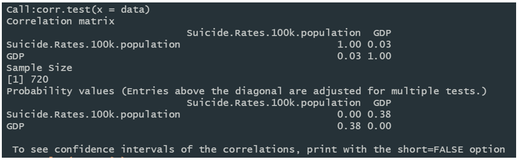

# Visualization-of-Global-suicide-rates

R App URL：<https://evonnetest.shinyapps.io/VisualizationOfGlobalSuicideRates/>

PS：`网站部分数据加载部分有些慢，需要等待一下`

这个项目以国家为主要变量，对各国不同年份的自杀率进行分析。 接下来，项目以GDP作为主要变量来研究自杀率。将各国的GDP数据和每年的自杀率进行综合、比较、分析，最后将结果可视化在网页上。目的是：试图找出GDP变化与自杀率变化之间的潜在关系，帮助研究人员从经济角度对自杀率进行更深入的研究。最后，分析了性别是否会影响自杀率

本课题的主要数据来源为：
世界银行官网(https://data.worldbanj.org/indicator/NY.GDP.MKTP.CD)
世卫组织官网(https://apps.who.int/gho/data/view.main.MHSUIDEv)

具体详细项目报告参考projectDocument文件夹

下面为设计图：(由于项目为英文版本，所以设计图稿为英文版)

Sheet1：

在执行这个项目的时候，我从互联网上找到了很多图表来寻找灵感，并分析了一些可能的可视化方法，包括线形图、条形图、饼状图、折线图、散点图等。这些灵感给了我一个很好的起点，帮助我以后构思设计。之后，我迅速概括了这些数据可视化的概念，并以最有效的方式展示了它们。

Sheet2：

我选择使用条形图显示不同国家的自杀率的趋势,用户可以选择不同的多年观察的变化在不同的国家在不同的年(表格数据1)。每个国家的颜色显示在右边的条形图。由于世界上有很多国家，用户可以选择自己感兴趣的国家，图表会发生变化。当用户选择一个国家时，条形图中该国家的颜色会变成红色，未选择的国家的颜色会变成灰色或其他相同的颜色。

Sheet3：

在这一节中，我将探讨GDP对自杀率的影响，因为我认为国家的经济水平可能是自杀的一个重要因素(table data 2)。所以，结合GDP，年份，国家的数据来探讨他们对自杀率的影响。另外，我选择用散点图来展示不同国家在不同年份的自杀率与GDP的关系。泡沫的大小代表了自杀率的数值。我选择用不同的颜色来标识国家。当用户将鼠标移到气泡上时，它将显示国家名称和当前GDP的值。同时，用户可以选择自己感兴趣的不同年份和国家，观察情节的变化。当用户选择一个国家时，该国家的条会变成红色，其他所有国家的条会变成蓝色。

Sheet4：

在这一部分中，我认为性别可能是影响自杀率的另一个因素。我创建了一个饼图来研究男性和女性自杀率的百分比，当用户将鼠标移到饼图上时，它会显示详细的信息。我还做了一个散点图来观察男性和女性自杀率的分布。用户可在饼图和散点图中通过颜色来区分性别。此外，用户可以选择特定的性别和不同的年份来观察自杀率的变化。

Sheet5：

我设计了导航，并把三个问题放在侧边栏的不同界面。用户可以点击网站上的不同标题，并选择查看图表。当用户点击不同的标题时，标题的颜色会变成绿色，从而给予用户反馈。进入不同的界面后，每个图形都会有一个交互功能，当人们在选择框中选择一个选项时，图形的显示会有所不同。

## 实施阶段：

在这个项目中，我使用的库是plot, shiny, plyr, shinythemes。

我认为plot是一个相对容易使用的可视化交互图包，它是一个完全用R创建反应性web应用程序的R包

同时，plot可以兼容多种语言/工具，包括R, Python, MATLAB, Perl, Julia和Arduino。此外，plotly的语法非常简单，比如R中的ggplot2，而plotly与ggplot兼容。shinythemes库可以改变网页导航条的主题，让网页看起来更专业。

在实际的编码中，我原本想用ggplot来制作网站上的交互式图形，但是我发现使用ggplot来制作交互式图形对我来说很难实现，用户点击Play按钮的功能也很难实现。因此，我选择使用Plotly包来实现它。

在这个项目中，我学会了如何分析数据，并使用合适的图表类型来显示数据。在实现过程中，我发现plot是一个非常实用的包，可以帮助我快速实现交互式图像。

关于这个项目的改进，我认为我应该在数据中加入经纬度，并使用地图来显示数据，这样你可以更直观的看到世界各地的自杀率分布。同时，添加每个国家所在大陆的信息，比如亚洲，北美等，来探索不同大陆的自杀率。可以分析自杀率是否与人文有关。

## 用户指南

1. ：打开网站，第一个网页会显示在你的面前，包括顶部导航栏，左边的过滤栏和右边的数据显示栏

2. 第一页的左边是“应用过滤器”的过滤栏。它下面有一个灰色的盒子，显示问题“哪个国家的自杀率最高?”
下面有一个转轮，默认情况下，“国家”被选中，这意味着右边的国家将显示所有的国家。您可以单击spinner并选择想要查看的国家

3. 右边的部分显示了一个条形图。x轴是国家，y轴是“全球自杀率/10万国家”。右端将显示所有国家的名称，按A到z的顺序排列。显示框有一个幻灯片，你可以自己滑动。默认情况下，图表会显示2000年所有国家的自杀率数据，每个国家都会用不同的颜色表示

4. 右侧的条形图可以过滤显示的国家。可以点击右边的国家名，图中代表国家的条形图会消失。
您还可以过滤左边，您可以选择一个国家，这个国家的条形图将变成红色，其他所有的条形图将变成蓝色。

5. 当鼠标移动到条形图中具体的条形数据时，会显示出该国家的国家名和自杀率

6. 年份可以在柱状图的底部选择。您可以点击“Play”按钮，年份将依次从2000年、2010年、2015年、2016年跳跃，或者您也可以直接点击或拖动选择年份

7. 点击导航栏中的“经济因素与自杀率的关系”，进入第二页。这个页面解决了问题2“经济变化是否对自杀率有影响

8. 页面布局与第一页大致相同。左边是过滤条，你可以选择国家，右边是散点图，显示的是“年自杀率和人均GDP图”。y轴是“全球自杀率(2000年)每10万人”，x轴是“人均GDP”。右端将显示所有国家的名称，按A到z的顺序排列。国家框有一个滑动条，可以自己滑动。默认情况下，图表将显示2000年所有国家的自杀率和GDP数据。每个国家的数据将用不同颜色的图表示，数据的大小将用图的半径表示

9. 当鼠标滑到散点图的某一特定位置时，就会显示出该数据的GDP、自杀率、国家名

10. 年份可以在散点图的底部选择。您可以点击“播放”按钮，年份将从2000年、2010年、2015年、2016年依次跳跃，也可以直接点击或拖动选择年份

11. 点击导航栏中的“男女自杀率比例”，就会进入第三个页面。这个页面解决了问题3“不同性别是否对自杀率有影响”

12. 该页面有两个图，左边是一个饼状图，右边是一个散点图。这个饼状图显示了性别在总自杀率中的百分比。名称为“不同性别的自杀率”，蓝色部分为男性，橙色部分为女性

13. 当鼠标滑过特定的饼图数据时，会显示数据名称和自杀率

14. 右边的散点图讲的是"不同性别的自杀率"与饼图的不同之处在于，散点图显示了不同国家在不同年份的性别比例，包括数量和强度

15. 当鼠标滑动到散点图中某一特定的图数据时，将显示该数据的比例和性别

16. 年份可以在散点图的底部选择。您可以点击“播放”按钮，年份将从2000年、2010年、2015年、2016年依次跳跃，也可以直接点击或拖动选择年份

## 数据处理

### Data wrangling

我使用python语言进行数据处理。以下是数据整理步骤:

(1)自杀率
1. 在python中读取自杀率数据并显示数据头
2. 更改列名(图1)
3. 将列(2016,2015,2010,2000)转换为行
4. 按列(国家和年份)对数据帧排序
5. 更改列的顺序

(2) GDP data wrangling
1. 用python读取GDP数据并显示数据头
2. 删除不需要的行(图5)
3. 更改列名(图6)
4. 将列(2010-2018)转换为行(图7)
5. 按列(国家和年份)排列数据帧(图8)

### Data checking

我使用python语言进行数据检查。数据检查步骤如下:
1. 检查空值(图10)
2. 定位空值(图11、12)
因为有些国家没有GDP值，所以我选择检查这些值并将它们插入数据帧中
3. 再次检查空值(图13)
由于这个国家的名字(“C ??“科特迪瓦”)，我选择删除这个国家的数据。
4. 查找重复的记录(图14)
因为我的数据中没有重复的行，所以不需要处理数据。
5. 数据逻辑检查(图15)
检查是否有自杀的价值
检查自杀率和GDP值是否小于0。
6. 检查数据离群值(图16、17、18)
我使用散点和箱线图来探索异常数据(图16和17)。数据显示有些国家的自杀率异常高，所以我选择了自杀率大于60的国家(图18)。虽然有一些方法可以处理这些离群值，例如删除或平均这些数据，但是为了显示真实的数据，这些离群值将被有意保存在数据源中。

### Data exploration

**全局分析：**
使用R中的柱状图分析2000年、2010年、2015年和2016年各国的自杀率值。由于国家众多，我将不同的自杀率数值按降序排列。图表中使用四种颜色(红、绿、蓝、紫)来表示年份(2000、2010、2015、2016)。可以发现，自杀率高的前三个国家是俄罗斯联邦(RUS)、立陶宛(LTU)和圭亚那(GUY)，而自杀率低的国家是格林纳达(GRD)、巴巴多斯(BRB)、安提瓜和巴布达(ATG)

**经济因素与自杀率的关系：**

在研究这一问题时，我选择年份、GDP和自杀率的数据来衡量GDP和自杀率之间的关系。曲线图显示了不同经济条件下四年自杀率的变化。在折线图中，横坐标是GDP值，纵坐标是自杀率/100k，用不同的颜色表示不同的年份。可以发现，当GDP处于较低水平时，数据过于密集，观察不到显著的趋势，但当GDP达到5.0e+12左右(e的意思是“乘以10”)时，自杀率显著下降。有趣的是，当GDP达到1.0e+13时，自杀率显著上升。

为了检验自杀率在GDP相对较高时趋于上升的假设，我创建了correlation来探究GDP和自杀率之间的相关系数。可以发现GDP与自杀率的相关系数为0.03。此外，散点图的数据趋势也反映了这一现象。图中横坐标和纵坐标分别代表GDP和自杀率，用不同的颜色表示不同的年份。每个国家代表一个数据点。曲线图显示

**男女自杀率的比例：**

我们将使用密度图来探索男性和女性自杀率的比例。图的横坐标代表每10万人中自杀群体的比例，纵坐标代表自杀率的强度。图中绿色的部分代表女性自杀率集中的趋势，紫色的部分代表男性。通过观察曲线图可以看出，女性自杀率在每100k人口中3人左右，约0.16人(密度)，男性自杀率在每100k人口中13人左右，约0.045人(密度)。这意味着女性的自杀率大多保持在3 / 10万左右，而男性的自杀率约为13 / 10万。这张曲线图表明男性的自杀率高于女性。

为了找到性别自杀率与GDP和年份之间的关系，我创建了散点图来分析它(图31&32)。横坐标代表GDP增长，纵坐标代表不同性别。这张图用不同的颜色表示不同的年份，用不同半径的圆圈表示不同的自杀率水平。
在这张散点图中，可以看到一些GDP水平较高的国家，女性的自杀率略有下降，但男性的自杀率略有上升。这可能反映出，较富裕的国家更容易自杀

